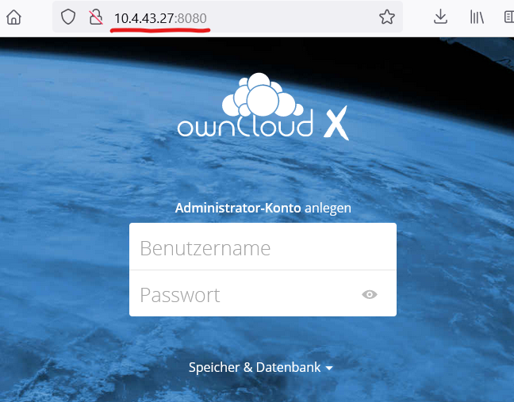
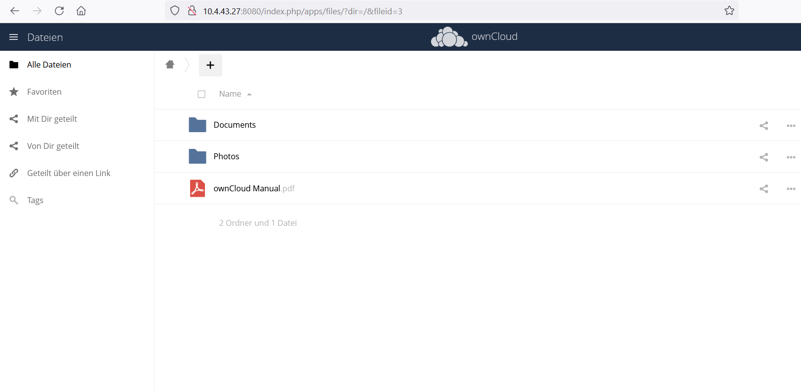

---
# LB2-Mailserver mit Docker aufsetzen
---
In diesem Projekt werden wir einen Container erstellen auf dem schlussendlich ein voll funktionstüchtigen Owncloud Server mit SQL Datenbank anbindung läuft wird auf dem man Zentral über Web-Interface monitoren und Anpassen kann. Dabei werde ich in diesem GitHub Repo erklären und beschreiben wie wir den Server aufgesetzt haben und was die Funktionen dieses Dienstes sind.

---
# Was ist Owncloud?
---


OwnCloud ist eine freie Software für das Speichern von Daten (Filehosting) auf einem eigenen Server. Bei Einsatz eines entsprechenden Clients wird dieser automatisch mit einem lokalen Verzeichnis synchronisiert. Dadurch kann von mehreren Rechnern auf einen konsistenten Datenbestand zugegriffen werden. Das Projekt wurde im Januar 2010 vom KDE-Entwickler Frank Karlitschek ins Leben gerufen, um eine freie Alternative zu kommerziellen Anbietern eines Cloud-Service zu schaffen. Im Gegensatz zu kommerziellen Speicherdiensten kann ownCloud auf einem privaten Server oder Webspace installiert werden.

---

Folgende Features sind inbegriffen:

1. Zugriff auf Ihre Daten:
Speichern Sie alle Ihre Dokumente, Ordner, Kontakte, Fotoalben, Kalender und andere Informationen auf einem Server Ihrer Wahl.
Sie können einen Desktop, ein mobiles Gerät oder einen Webbrowser verwenden, um auf diesen Ordner zuzugreifen.
Sie können jederzeit und von jedem Ort aus auf Ihre Daten zugreifen.


2. Synchronisation der Daten
Synchronisieren Sie die Kalender, Kontakte, Fotoalben und andere Daten Ihrer Geräte.

3. Daten Verfügbar machen.
Greifen Sie auf Ihre neuesten Fotogalerien, Kalender, Musik und andere Inhalte zu, indem Sie Ihre Daten für andere freigeben.
Teilen Sie sie entweder offen oder heimlich.
Ihre Daten gehören Ihnen und Sie können sie verwenden, wie Sie wollen. 

4. Versionierung bei Änderungen einer Datei

5. Verschlüsselung der Daten
Wenn die Verschlüsselungsanwendung aktiviert ist, werden alle auf dem ownCloud-Server gespeicherten Dateien mit Ihrem Passwort verschlüsselt.

6. Hochladen per Drag & Drop

7. Anwendungs-API's
Neue, öffentlich definierte APIs machen die Erstellung von Anwendungen für ownCloud viel einfacher und ermöglichen zusätzliche Funktionen und einen stabilen Integrationspunkt für zukünftige Versionen.

8. Migration und Backup Funktionen

9. Protokollierung
Owncloud kann sowohl in Syslog-Protokolldateien als auch in die bestehende ownCloud-Protokolldatei schreiben.

---
# Umsetzung
---

1. Beim ersten Befehl ladet man das Owncloud Image auf den lokalen Host herunter
```
$> docker pull owncloud
```

2. Mit folgendem Befehl zeigt man die Version und grösse des Images an
```
$> docker images ¦ grep owncloud
```

3. Mit fogendem Befehl startet man die VM mit dem heruntergeladenen Image und verknüpft sie mit einem SQL-Datenbank Container welcher zusätzlich erstellt wird.
```
$> docker run --name owncloud -h owncloud -p 8080:80 --link mysql01:mysql -d owncloud
```

4. Mit diesem Befehl zeigt man die laufenden Container an und kann das Portforwarding prüfen.
```
$> docker ps
```

5. Jetzt hat man die Möglichkeit die Logs des laufenden Container anzuzeigen.
```
$> docker logs -f owncloud
```

6. Im nächsten Schritt gibt man in den Browser die IP des Containers und den entsprechenden Port an, um auf das Interface der Owncloud zuzugreifen:



7. Nun hat man die Möglichkeit ein Benutzer zu erstellen und anschliessend unter "Storage & database" den Pfad und die SQL Logindaten des Root Benutzer anzugeben. Dafür muss man mit folgendem Befehl auf den Container zugreifen:
```
$> docker exec -it mysql01 bash
```

8. Nun hat man Zugriff auf den mysql Container und gibt anschliessend folgenden Befehl ein, um auf die Datenbank zuzugreifen:
```
$> mysql -uroot -p
```

9. Im nächsten Schritt erstellt man eine Datenbank mit dem namen mysql01
```
$> create database owncloud
```

10. Wenn diese Schritte erledigt sind, kann man nun zurück auf das Owncloud Interface zugreifen und die Login Daten eingeben des SQL Root Benutzers.

11. Nun hat man sich erfolgreich auf die DB connected und es funktionierte.



---
# Image-Bereitstellung

Um Images für andere Personen bereitzustellen, hat man die Möglichkeit Images die man selber erstellt, in Docker Hub hochzuladen.
Docker Hub ist ein Onlinedienst, der eine Registry für Docker-Images und Repositories beinhaltet. Die Registry teilt sich in einen öffentlichen und einen privaten Teil auf. Im öffentlichen Teil kann jeder Nutzer seine selbst erstellten Images hochladen und damit anderen Nutzern zur Verfügung stellen. Außerdem gibt es mittlerweile offizielle Images, z. B. von Linux-Distributoren. Im privaten Teil von Docker Hub können Benutzer ihre Docker-Images hochladen und dadurch einfach z. B. firmenintern verteilen, ohne dass diese damit öffentlich auffindbar sind.

Folgende Befehle sind nötig um das Image in den eigenen Docker Hub Account hochzuladen:


1. Zuerst muss man bei Docker Hub einen Account erstellen
2. Danach hat man die Möglichkeit mit folgendem Befehl das Image zu erstellen mit einem Versions Tag am Schluss.
```
$> sudo docker commit -m "Version 1" -a "Léon Rezek und Alessandro Adelidia" mysql:5.6 leonrezek/mysql:1.0
```

3. Image hochladen:

```
$> $ docker push username/mysql
```

# Error-Handling

Bei Problemem bei der Umsetzung haben wir über Google probiert das Problem zu beheben, die Lehrperson gefragt oder andere Teams angeschrieben, ob diese das gleiche Problem hatten.

---

# Troubleshooting

Am Anfang hatten wir Probleme bei der Auswahl des Projektes. Nachdem wir und über mögliche Themen im Internet umgesehen haben hatten wir uns schlussendlich auf das Owncloud Projekt fokussiert. Zudem gab es Probleme mit dem MYSQL Container bei der Verbindung mit dem Owncloud Container bei dem folgende Meldung erschien: "Authentication failed" . Das Problem war am Schluss das die latest Version des MYSQL Container nicht mit Owncloud funktionierte und man eine ältere Version installieren musste. Danach konnte man die Datenbank erfolgreich hinzufügen und es funktionerte. 

# Quellenverzeichnis

Youtube Tutorial: https://www.youtube.com/watch?v=R6vzgai8kv0

Docker Run: https://web.microsoftstream.com/video/83fcd7b5-c36b-4ca8-8433-73d7aff4fb19?list=user&userId=91407230-9462-4d68-a2e7-13e41cfe3aaf

Docker Compose: https://web.microsoftstream.com/video/c8605a61-35c6-4380-9fb9-387733085b44?list=user&userId=91407230-9462-4d68-a2e7-13e41cfe3aaf

Unterstützung durch Aqeb Ahmed

---

**OpenSource Lizenz**
- - -
<a rel="license" href="http://creativecommons.org/licenses/by-nc-sa/3.0/ch/"></a><br />Dieses Werk ist lizenziert unter einer <a rel="license" href="http://creativecommons.org/licenses/by-nc-sa/3.0/ch/">Creative Commons Namensnennung - Nicht-kommerziell - Weitergabe unter gleichen Bedingungen 3.0 Schweiz Lizenz</a>


